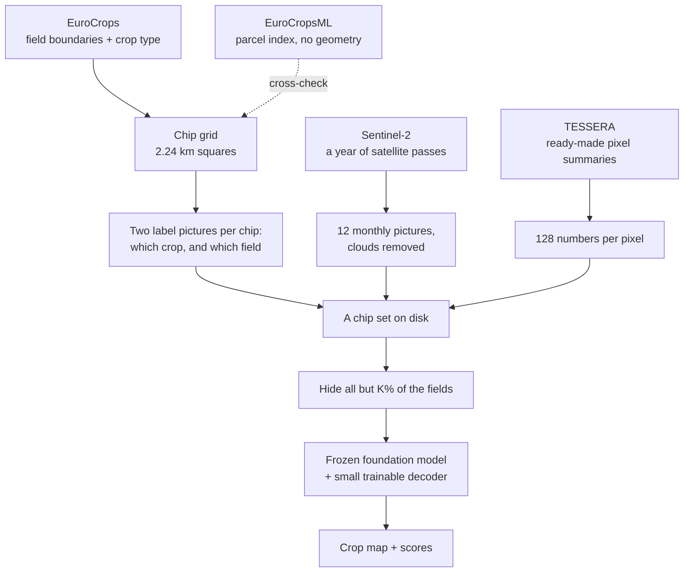
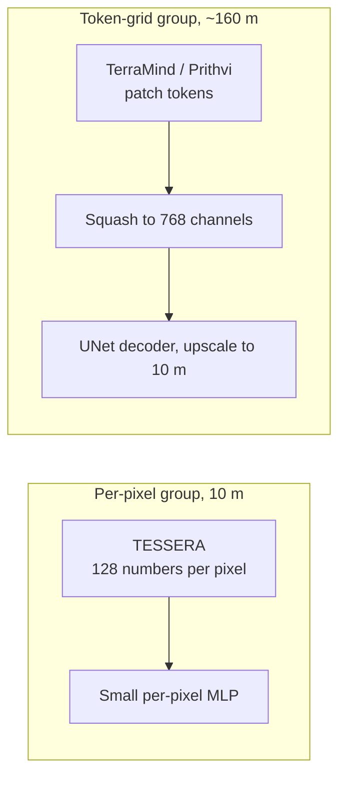

# The pipeline in plain language

A walkthrough of the same machinery described in [pipeline.md](pipeline.md), without the
implementation detail. Read this one to understand what the system does; read that one to
change it.

---

## What the system is for

A user names an area. The system returns a map that says which crop grows in each 10 m pixel,
an explanation of why, and a confidence for each pixel. Phase 1 builds the map. Phases 2 and 3
add the explanation and the report.

The single idea that shapes everything else:

> **A human annotates a field. The model predicts a pixel.**

One field boundary is one act of annotation and produces a few thousand labelled pixels. So
when we ask "how few labels does this need", the honest unit is fields, not pixels. Counting
pixels would flatter the method enormously and answer a question nobody asked.

---

## The chain

---

## Step by step

**1. Where the fields are.** EuroCrops gives the field boundaries farmers declared, with the
crop each one holds. That is the ground truth. EuroCropsML describes the same declarations but
ships no boundaries, so it is used as a cross-check rather than as training data.

**2. Cutting the country into tiles.** The country is divided into a fixed grid of 2.24 km
squares, each 224 by 224 pixels at 10 m. The grid is anchored to the map projection rather than
to the data, so tile "EE_02354_01821" always means the same patch of ground, whatever else
changes. Estonia comes to 7,398 tiles.

**3. Two label pictures per tile.** One says *which crop* is in each pixel. The other says
*which field* each pixel belongs to. The second one looks redundant and is the key to the whole
experiment, for the reason in step 6.

**4. A year of satellite imagery, cleaned.** For each tile we pull every Sentinel-2 pass over
2021 and reduce it to twelve monthly pictures, one per month, each the median of the cloud-free
views of that month. Clouds, shadow, snow and cirrus are thrown out first, using the classification
the satellite product ships. Where a month has no clear view of a pixel, the value is interpolated
from the nearest clear months, and the tile records how much of it was filled that way, because a
Baltic December is mostly guesswork and the reader should be able to see that.

Twelve months matter because crops are told apart by *when* they green up and die back, not by
what they look like on any single day. Winter wheat and spring barley can look identical in July.

**5. A second, ready-made view.** TESSERA has already digested a full year of Sentinel-1 and
Sentinel-2 for every 10 m pixel on Earth into 128 numbers. We download those numbers for the same
tiles. This gives two very different inputs over identical labels, which is what makes the
comparison fair.

**6. Hiding most of the labels.** This is the experiment. To ask "what if we had only annotated
5 % of the fields", we do not re-download anything. We keep the imagery exactly as it is and
simply hide the crop labels everywhere except in a random 5 % of the fields **of each crop
type**. The "which field" picture from step 3 is what lets us do that hiding at training time.

Two details that matter:

- The percentage is applied *per crop*, not overall. Take 5 % of everything pooled and the rare
  crops disappear entirely, and the score then collapses for a reason that has nothing to do
  with the model being tested.
- Only the *training* labels are hidden. The model is always scored against complete labels,
  because the budget is meant to restrict what it learns from, not what it is judged on.

**7. Training.** The foundation model itself is **frozen**: its weights never change. We train
only a small decoder on top, which reads the frozen model's output and produces the crop map.

This is deliberate. Two of the four models we compare only exist as precomputed numbers, so they
*cannot* be fine-tuned. Allowing the others to fine-tune would compare a model that got to adapt
against models that did not.

---

## Why the comparison needs care

Two traps, both of which we hit and had to fix.

**The decoders must be the same size.** If one model gets a 815 M-parameter decoder and another
gets 63 M, the winner may just be whoever got the bigger decoder. TerraMind stacks twelve monthly
outputs, which silently inflated its decoder until we added a projection to squash it back down.
All the tile-grid models now carry an identical 12.9 M decoder.

**The models do not see the same detail.** TESSERA produces one vector per 10 m pixel. The
transformer models produce one vector per ~160 m patch, which then has to be upscaled back to
10 m. That is a 256-fold difference in starting spatial detail, before the encoder is even
considered. So a TESSERA-versus-transformer gap is *not* evidence about encoder quality, and the
two are compared within their own group first.

---

## What the pilot can and cannot tell you

The current numbers come from **twelve tiles**, eight for training and four for validation, with
no separate test set. They exist to prove the machinery runs end to end, and the manifest says so
in as many words.

What they can support: that the pipeline works, that the budget mechanism is sound, and that the
gap between the per-pixel and token-grid groups is large.

What they cannot support: any fine distinction between the transformer models. Repeating an
identical run moves the score by about as much as the gaps between those models, so on this pilot
they are indistinguishable. Fixing that needs the full Estonian export, a proper spatial split,
and several random draws per budget, which is exactly what the protocol asks for and what the
running export is being built for.
